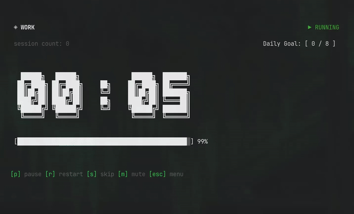

# Pomo Doro

A sleek, modular Pomodoro timer for your terminal, built with React, Ink, and TypeScript.


## Features

- **TUI Interface**: Clean terminal UI with big text and progress bars.
- **Smart & Customizable Sessions**: Cycle between Work and Breaks automatically with built-in presets, or create custom intervals using the interactive setup wizard.
- **Productivity Dashboard & Daily Goals**: Track your total focus time, set daily Pomodoro goals, configure your daily focus time goal, and see a 15-week history chart.
- **Interactive Settings Menu**: Dynamically configure your daily goals and toggle OS notifications on the fly.
- **Analytics Dashboard**: GitHub-style activity heatmaps, horizontal stacked bar charts, and productivity tracking over 15 weeks.
- **Responsive Layout**: Gracefully adapts between side-by-side and vertical stacked layouts depending on terminal window size.
- **System Integration**: Cross-platform system notifications with sound alerts using `node-notifier` and `play-sound` (supports Linux, macOS, and Windows).
- **Persistence**: Remembers your progress and allows you to resume sessions.
- **Development Sandbox**: Dedicated test mode with ultra-short timers for rapid testing.

## Installation & Usage

### Global Installation (Recommended)

You can install Pomo Doro globally and run it from anywhere in your terminal:

```bash
npm install -g pomo-doro-tui
```

After installation, run `pomo` to start the interactive menu, or launch a custom session directly using command-line options:

```bash
# Start with interactive menu
pomo

# Start immediately with a 50-minute work session and a 10-minute break
pomo --work 50 --break 10
```

#### CLI Options

| Option                   | Alias | Description                                                          |
| :----------------------- | :---- | :------------------------------------------------------------------- |
| `--work <minutes>`       | `-w`  | Set custom focus session duration (minutes)                          |
| `--break <minutes>`      | `-b`  | Set custom short break duration (minutes)                            |
| `--long-break <minutes>` | `-l`  | Set custom long break duration (minutes, defaults to 3x short break) |
| `--tag <string>`         | `-t`  | Set the tag/category name                                            |
| `--description <string>` | `-d`  | Set an optional description for the session                          |
| `--goal <number>`        | `-g`  | Set your Daily Pomodoro Goal                                         |
| `--help`                 | `-h`  | Show help details                                                    |

> [!NOTE]
> The `--work` (or `-w`) option is required if you want to customize break durations via the command line. When you use CLI arguments to start a timer, the main menu is bypassed, and the session begins immediately.

### Local Development

Or if you want to run from source:

```bash
# Clone the repository
git clone https://github.com/dandrok/pomo_doro.git
cd pomo_doro

# Install dependencies
npm install

# Run the app
npm run dev
```

## Controls

### General & Timer Controls

| Key      | Action                                                                         |
| :------- | :----------------------------------------------------------------------------- |
| `p`      | Toggle pause / resume                                                          |
| `r`      | Restart current timer from the beginning                                       |
| `s`      | Skip current session (discards work session, skips break to start focus early) |
| `m`      | Toggle mute (silence OS notifications and audio alerts)                        |
| `Esc`    | Go back to previous menu, or safely pause/exit the current timer to the menu   |
| `Ctrl+C` | Force quit application                                                         |

### Custom Preset & Settings Controls

| Key              | Action                                                                              |
| :--------------- | :---------------------------------------------------------------------------------- |
| `Up` / `Down`    | Navigate between fields (Focus, Short Break, Long Break, Tag, Description, Start)   |
| `Left` / `Right` | Decrease / Increase the active duration value, or cycle between default/recent tags |
| `Typing`         | Enter custom tags and descriptions on their respective fields                       |
| `Enter`          | Advance to the next field, or start session (when on Start)                         |

## Project Structure

The project follows a clean, modular architecture supported by TypeScript path aliases:

- `src/cli.tsx`: The CLI entry point.
- `src/app.tsx`: Main app container.
- `src/types.ts`: Centralized TypeScript definitions. Mapped via `@types`.
- `src/components/`: Reusable React components. Mapped via `@screens` and `@ui`:
  - `screens/`: High-level views (e.g., `MainMenu`, `TimeSelect`, `SessionSetup`, `History`, `Settings`, `Timer`, `About`, `Resume`, `Router`).
  - `ui/`: Structure and display elements (e.g., `Layout`, `ProgressBar`, `ActivityHeatmap`, `StackedBarChart`, `HeaderBar`, `FooterBar`, `FormRow`).
- `src/hooks/`: Custom React hooks (e.g., `useTimer`, `useHistory`, `usePomodoroSession`, `useSessionSetup`). Mapped via `@hooks`.
- `src/utils/`: Utilities, configs, and side-effects. Mapped via `@utils`:
  - `config.ts`: Conf-based settings & history persistence.
  - `constants.ts`: Timer presets, icons, and color rules.
  - `helpers.ts`: Pure string and time formatters.
  - `historyLogic.ts`: Aggregation logic for analytics.
  - `notifications.ts`: Desktop notification & audio controller.
  - `cliParser.ts`: Command-line arguments parser and validator.

## Development

```bash
# Run in development mode
npm run dev

# Run in Test Mode (Sandbox)
# Uses 6-second timers and a separate database
npm run dev:test

# Run tests
npm test

# Run tests with Vitest UI dashboard
npm run test:ui

# Format the code (Prettier)
npm run format

# Run full QA check (Typecheck, Lint, Format)
npm run check

# Build the project
npm run build
```

## CI/CD & Releases

This project uses **GitHub Actions** for automated quality control:

- **On Push/PR**: Automatically runs type-checking and unit tests.
- **On Release**: Automatically builds and publishes the new version to the NPM registry when a GitHub Release is created.

## License

ISC
